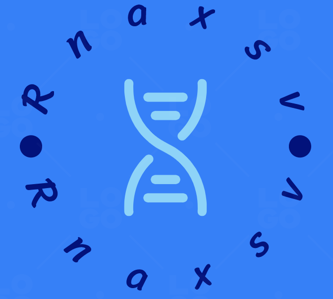

# Isocomp: comparing high-quality IsoSeq3 isoforms between samples

## Contributors
1. Yutong Qiu (Carnegie Mellon)
2. Chia Sin	Liew (University of Nebraska-Lincoln)
3. Chase Mateusiak (Washington University)
4. Rupesh Kesharwani (Baylor College of Medicine)
5. Bida	Gu (University of Southern California)
6. Muhammad Sohail Raza (Beijing Institute of Genomics, Chinese Academy of Sciences/China National Center for Bioinformation)
6. Evan	Biederstedt (HMS)

## Introduction
NGS targeted sequencing and WES have become routine for clinical diagnosis of Mendelian disease [CITATION]. Family sequencing (or "trio sequencing") involves sequencing a patient and parents (trio) or other relatives. This improves the diagnostic potential via the interpretation of germline mutations and enables detection of de novo mutations which underlie most Mendelian disorders. 

Transcriptomic profiling has been gaining used over the past several decades. However, this endeavor has been hampered by short-read sequencing, especially for inferring alternative splicing, allelic imbalance, and isoform variation. 

The promise of long-read sequencing has been to overcome the inherent uncertainties of short-reads. 

Something something Isoseq3: https://www.pacb.com/products-and-services/applications/rna-sequencing/

Provides high-quality, polished, assembled full isoforms. With this, we will be able to identify alternatively-spliced isoforms and detect gene fusions. 

Since the advent of HiFi reads, the error rates have plummeted. 

The goal of this project will be to extend the utility of long-read RNAseq for investigating Mendelian diseases between multiple samples. 

And what about gene fusions? We detect these in the stupidest possible way with short-read sequencing, and we think they're cancer-specific. What about the germline?

## Goals

Given high-quality assembled isoforms from 2-3 samples, we want to algorithmically (definitively) characterize the "unique" (i.e. differing) isoforms between samples.

## Description

## Flowchart

### To extract sets of unique isoforms

### To annotate the unique isoforms

## Quick start

## Computational Resources / Operation

## Citations
[1] https://www.pacb.com/products-and-services/applications/rna-sequencing/

