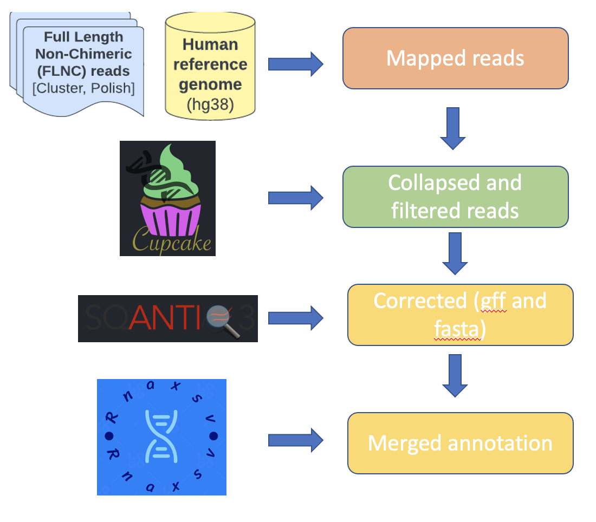

[](https://github.com/cmatKhan/isocomp/actions/workflows/python-package.yml)

# Isocomp: comparing high-quality IsoSeq3 isoforms between samples


## Contributors
1. Yutong Qiu (Carnegie Mellon)
2. Chia Sin	Liew (University of Nebraska-Lincoln)
3. Chase Mateusiak (Washington University)
4. Rupesh Kesharwani (Baylor College of Medicine)
5. Bida	Gu (University of Southern California)
6. Muhammad Sohail Raza (Beijing Institute of Genomics, Chinese Academy of Sciences/China National Center for Bioinformation)
7. Evan	Biederstedt (HMS)
8. Umran Yaman (UK Dementia Research Institute, University College London)
9. Abdullah Al Nahid (Shahjalal University of Science and Technology)
10. Trinh Tat (Houston Methodist Research Institute)
11. Sejal Modha (Theolytics Limited)
    
## Github Codespace for Development

To use codespaces for development purposes, do the following:

1. fork the repo
2. switch to the 'develop' branch
    - **NOTE**: if you plan to code/add a feature, create a branch from the 'develop' branch. Switch to it, and then continue on with the steps below.
4. click the green 'code' button. **But**, rather than copying the https or ssh link, click the tab that says "Codespace"
5. click the button that says "create codespace on develop". Go make some tea -- it takes ~5 minutes or so to set up the environment. But, once it is set up, you
   will have a fully functioning vscode environment with all the dependencies installed. Start running the tests, set some breakpoints, take a look around!

## Detailed project overview
https://github.com/collaborativebioinformatics/isocomp/blob/main/FinalPresentation_BCM_Hackathon_12Oct2022.pdf 

## Introduction
NGS-targeted sequencing and WES have become routine for diagnosing Mendelian disease (Xue et al., 2015). Family sequencing (or "trio sequencing") involves sequencing a patient and parents (trio) or other relatives. This improves the diagnostic potential via the interpretation of germline mutations and enables the detection of de novo mutations which underlie most Mendelian disorders. 

While transcriptomic profiling has gained traction over the past few decades, its progress has been hindered by short-read sequencing, particularly in tasks such as inferring alternative splicing, allelic imbalance, and isoform variation.

The potential of long-read sequencing lies in its ability to overcome the inherent limitations of short-reads. Tools like Isoseq3 [link: https://www.pacb.com/products-and-services/applications/rna-sequencing/] offer high-quality, polished and assembled full-length isoforms. This advancement allows us to identify alternatively spliced isoforms and detect gene fusions.

Provides high-quality, polished, assembled full isoforms. With this, we will be able to identify alternatively spliced isoforms and detect gene fusions. 

With the introduction of HiFi error rates have significantly decreased.

This project aims to expand the applicability of long-read RNAseq for investigating Mendelian diseases across multiple samples.

-And what about gene fusions? We detect these in the stupidest possible way with short-read sequencing, and we think they're cancer-specific. What about the germline?


## Goals

The goal of this project is to algorithmically characterize the "unique" (differing) isoforms between 2-3 samples using high-quality assembled isoforms.

## Methods

### Overview of Methods

The core challenge, referred to as the "Isoform set comparison problem," involves identifying distinct isoforms between two sets of samples.

A direct approach to solving this problem is through sequence matching between the sets of isoforms. However, this becomes time-consuming given the size of isoform sets in the human genome (consider a number significantly larger than 10,000, for instance).

We recognize that an all-against-all alignment across complete isoform sets isn't necessary. Instead, the focus is on comparing isoforms aligned to the same genomic regions. Genomic windows containing at least one isoform from any sample are extracted. The isoform sets are then subdivided into smaller subsets based on their origin in these extracted regions.

For each pair of samples under comparison, intersections are made between subsets of isoforms within each genomic window. This process identifies isoforms shared by both samples and isoforms unique to each sample.

For each unique isoform S from sample A, a deeper analysis is conducted on the differences between S and other isoforms from sample B within the same genomic window.

### Aligning isoforms to the reference genome

For each individual sample, we initially prefix the sample name to the FASTA sequences in the finalized corrected FASTA output from SQANTI. This step ensures the uniqueness of all sequence names. Subsequently, we employ the minimap2 aligner (v2.24-r1122) to align the renamed FASTA sequences against the human Telomere-to-Telomere genome assembly of the CHM13 cell line (T2T-CHM13v2.0; RefSeq - GCF_009914755.1). The resultant alignment is presented in a SAM file, which is then converted into BAM format and sorted using samtools (v1.15.1; Danecek et al, 2021).

### Segmentation of Isoforms into Subsets

Regions from the CHM13v2.0 genome that intersect with at least one isoform from any given sample are extracted. We initially determine the average coverage of isoforms per base using samtools mpileup  (version?, Danecek et al, 2021). Subsequently, we identify and extract the 20,042 annotated protein-coding gene regions from the reference genome. To create windows, we merge these regions where overlaps occur. Further refinement is applied by filtering windows to those displaying per-base coverage greater than 0.05, resulting in a final set of 11,936 windows.

Apart from the annotated gene regions, each sample encompasses over 100,000 isoforms (Table 1) that align with intron regions. These isoforms, often considered novel, hold potential relevance to the observed phenotypes. To account for these, we divide the genome into 100-base-pair windows and retain those exhibiting per-base coverage exceeding 0.05.

Following this, the gene-related windows and the 100-base-pair windows are merged to form a comprehensive set of windows aligning with any isoform.

### Intersecting subsets of isoforms

For every isoform S within the subset of sample A, we conduct precise string matching against all isoforms within the subset of sample B. If no isoform in sample B, within the same genomic window, precisely matches S, we classify S as unique.

### Comparing unique isoforms with other isoforms

For each unique isoform U, we employ the Needleman-Wunch alignment method to compare U with other isoforms within the identical genomic window. The comparison is quantified through the percentage of matched bases in U.

### Annotating the differences between unique isoforms and the other sequences

Differences among isoforms are categorized into [TODO] SNPs (<5bp), large-scale variants (>5bp), gene fusions, distinct exon utilization, and entirely novel sequences. These categories build upon those used by SQANTI to annotate disparities between sample isoforms and the reference transcriptome. Notably, we extend SQANTI's categories by incorporating SNPs and large-scale variants.

### Iso-Seq analysis

Isoseq3 (v3.2.2) generated HQ (Full-length high quality) transcripts [Table 1] were mapped to GRCh38 (v33 p13) using Minimap2 long-read alignment tools [1] (v2.24-r1122; commands: minimap2 -t 8 -ax splice:hq -uf --secondary=no -C5 -O6,24 -B4 GRCh38.v33p13.primary_assembly.fa sample.polished.hq.fastq.gz). Basic statistics of the alignment for each sample [NA24385 /HG002, NA24143/HG004, and NA24631/HG005] are provided in Table 2. The cDNA_cupcake workflow [https://github.com/Magdoll/cDNA_Cupcake] was then executed to collapse redundant isoforms from the BAM file. Low-count isoforms (<10) were filtered out, as well as 5' degraded isoforms that might lack biological significance. Subsequently, SQANTI3 [2] was employed to generate the final corrected fasta [Table 3a] transcripts and GTF [Table 3b] files, along with isoform classification reports. External databases, including the reference data set of transcription start sites (refTSS), a list of polyA motifs, tappAS-annotation, and Genecode hg38 annotation, were utilized. Finally, IsoAnnotLite (v2.7.3) analysis was conducted to annotate the GTF file from SQANTI3.

Differences between isoforms are categorized into [TODO] SNPs (<5bp), large-scale variants (>5bp), gene fusion, different exon usage, and completely novel sequences. These categories build upon those used by SQANTI to annotate disparities between sample isoforms and the reference transcriptome. Note that we extend the categories provided by SQANTI by adding SNPs and large-scale variants.

## Description

## Flowchart

### To extract sets of unique isoforms

### To annotate the unique isoforms


## Example Output

For each isoform that is unique to at least one sample, we provide information about the read and the similarity between that isoform and the most similar isoform within the same window.

The last column describes the normalized edit distance and the CIGAR string.

```
win_chr win_start       win_end total_isoform   isoform_name    sample_from     sample_compared_to      mapped_start    isoform_sequence        selected_alignments
NC_060925.1     255178  288416  4       PB.6.2  HG004   HG002   255173  GGATTATCCGGAGCCAAGGTCCGCTCGGGTGAGTGCCCTCCGCTTTTT      0.02_HG002_PB.6.2_3=6I1=3I1286=11I
NC_060925.1     255178  288416  4       PB.6.2  HG004   HG005   255173  GGATTATCCGGAGCCAAGGTCCGCTCGGGTGAGTGCCCTCCGCTTTTTG      0.02_HG002_PB.6.2_3=6I1=3I1286=11
```

### Deployment

Eventually, `pip install isocomp`.  But not yet.

## DEPENDENCIES

python >=3.9

If you're working on `ada`, you'll need to update the old, crusty version of 
python to something more modern and exciting. 

__The easy way__ (untested, but should work):

Install miniconda and create a conda env 
with python 3.9

__The manual method ([source](https://askubuntu.com/a/1424179))__ (tested, works):

```
ssh ... # your username login to ada

mkdir /home/${USER}/.local

# use your favorite text editor. no need to be vim
vim /home/${USER}/.bashrc

# add the following to the end (or where ever)
export PATH=/home/$USER/.local/bin:$PATH

# logout of the current session and log back in
exit
ssh ... (your username, etc)

# Download a more current version of python
wget https://www.python.org/ftp/python/3.9.15/Python-3.9.15.tgz

# unpack
tar xfp Python-3.9.15.tgz 
# remove the tarball
rm Python-3.9.15.tgz 

# cd into the Python package dir, configure and make
cd Python-3.9.15/

./configure --prefix=/home/${USER}/.local --exec_prefix=/home/${USER}/.local --enable-optimizations

make # this takes some time

make altinstall

# the following should point at a python in your /home/$USER/.local/bin dir
which python3.9

# optional, but convenient
ln -s /home/$USER/.local/bin/python3.9 /home/$USER/.local/bin/python

# Download the pip installer
curl https://bootstrap.pypa.io/get-pip.py -o get-pip.py
# install pip
python3.9 get-pip.py

# confirm that pip is where you think it is
which pip # location should be in your .local

# at this point, you can do:
pip install poetry

# and continue with the development install below

```
### Development

Install [poetry](https://python-poetry.org/) and consider setting [the configuration 
such that virtual environments for a given projects are installed in that project 
directory](https://python-poetry.org/docs/configuration/#local-configuration).  

Next, I like working on a fork rather than the actual repository of record. I set my 
[git remotes](https://git-scm.com/book/en/v2/Git-Basics-Working-with-Remotes) so that `origin` points to 
my fork, and `upstream` points to the 'upstream' repository.

```bash
➜  isocomp git:(develop) ✗ git remote -v 
origin  https://github.com/cmatKhan/isocomp.git (fetch)
origin  https://github.com/cmatKhan/isocomp.git (push)
upstream        https://github.com/collaborativebioinformatics/isocomp.git (fetch)
upstream        https://github.com/collaborativebioinformatics/isocomp.git (push)
```

On your machine, `cd` into your local repository, `git checkout` the development 
branch, and make sure it is up-to-date with the upstream (ie the original) repository. 

__NOTE__: if you branch, in general make sure you branch off the `develop` repo, not `main`!  

Then (assuming poetry is installed already), do:

```bash
$ poetry install
```

This will install the virtual environment with the dependencies (and the dependencies' dependencies) 
listed in the [pyproject.toml](./pyproject.toml).
### <u>Adding dependencies</u>

To add a development dependency (eg, `mkdocs` is not something a user needs), 
use `poetry add -D <dependency>` this is equivalent to `pip install`ing into your 
virtual environment with the added benefit that the dependency is tracked in the 
[pyproject.toml](./pyproject.toml).  

To add a deployment dependency, just omit the `-D` flag.  

### <u>Writing code</u>

Do this first!

```bash
$ pip install -e .
```

[This is an 'editable install'](https://stackoverflow.com/questions/35064426/when-would-the-e-editable-option-be-useful-with-pip-install) 
and means that any change you make in your code is immediately available in your environment. 
__NOTE__: If you happen to see a [Logging Error](https://github.com/pypa/pip/issues/11309) when you run the `pip install -e .` 
command, you can ignore it.  

If you use vscode, [this is a useful 
plugin](https://marketplace.visualstudio.com/items?itemName=jshaptic.autodocs-vscode-support) 
which will automatically generate docstrings for you. [Default docstring format is google](https://sphinxcontrib-napoleon.readthedocs.io/en/latest/example_google.html), 
which is what the scripts we currently have use. This is an example of what a google formatted 
docstring looks like:

```python
def get_all_windows(gene_df:pd.DataFrame, bp_df:pd.DataFrame) -> pd.DataFrame:
    """From gene boundaries and 100 bp nonzero coverage windows, produce a merged window df

    Args:
        gene_df (pd.DataFrame): one window per gene, > 0.05 avg coverage
        bp_df (pd.DataFrame): one window per 100 bp, > 0.05 avg coverage

    Returns:
        pd.DataFrame: merged windows df
    """
    ...
```

In the function definition, the [type hints](https://docs.python.org/3/library/typing.html) of the arguments (eg `gene_df:pdDataFrame`)
are *not* required, but if you include them, autoDocs will automatically 
generate the data types in the docstring skeleton, also, which is nice. The `-> <datatype>` 
at the end of the function definition is the return data type.

### <u>Tests</u>

Unit tests can be written into the [src/tests](./src/tests) directory. There is 
an example in [src/tests/test_isocomp.py](./src/tests/test_isocomp.py). There are a couple other 
examples of tests -- ie for logging and error handling -- 
[here, too](https://github.com/cmatKhan/lmdemo/blob/main/tests/test_lmdemo.py).

### <u>Build</u>

It's good to intermittently build the package as you go. To do so, use `poetry build` 
which will create a `.whl` and `.tar.gz` (`dist` is already included 
in the [gitignore](./.gitignore)). You can 'distribute' these files to others -- they 
can be installed with `pip` or `conda` -- or use them to install the software outside of 
your current virtual environment.

### <u>Documentation</u>

If you would like to write documentation (ie not docstrings, but long form letters 
to your adoring users), then this can be done in markdown 
[__or jupyter notebooks__](https://pypi.org/project/mkdocs-jupyter/) (already added as a dev dependency) in the 
[docs](./docs) directory. Add the markdown/notebook document to the `nav` section in 
the [mkdocs.yml](./mkdocs.yml) and it will be added to the menu of the documentation 
site. Use `mkdocs serve` locally to see what the documentation looks like. 
`mkdocs build` will build the site in a directory called `site`, which is in the .gitignore already. 
Like `poetry build` it is a good diea to do `mkdocs build` intermittently as you write documentation. 
Eventually, we'll use `mkdocs gh-deploy` to deploy the site to github pages. Maybe if we get fancy, we'll 
set up the github actions to build the package on mac,windows and linux OSes on every push to develop, and rebuild 
the docs and push the package to pypi on every push to `main`.


## Computational Resources / Operation

## Citations
[1] https://www.pacb.com/products-and-services/applications/rna-sequencing/

